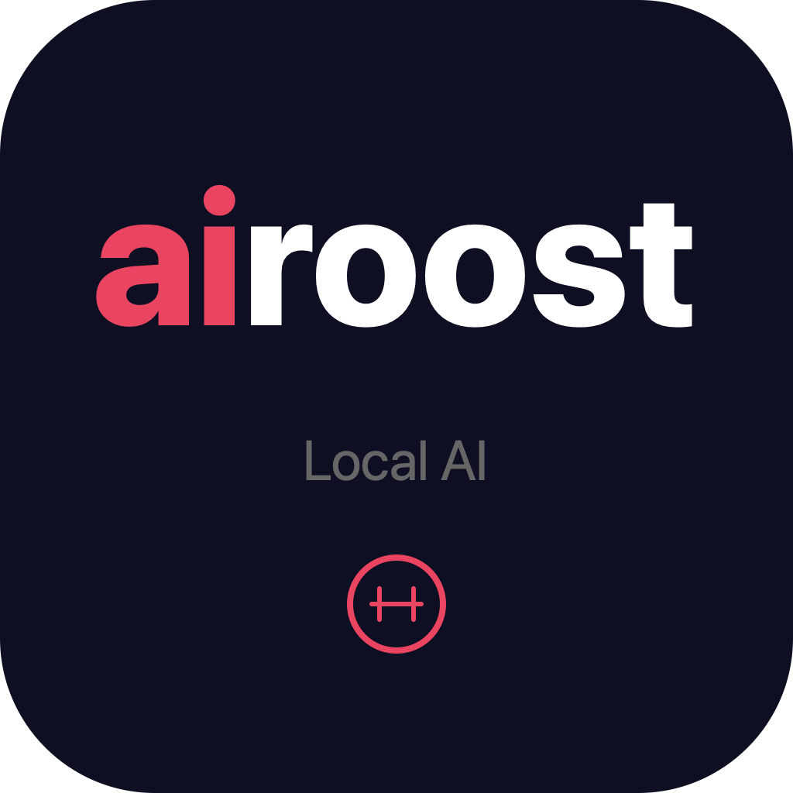

<p align="center">
  
</p>

<h1 align="center">airoost</h1>

<p align="center">
  <strong>The VLC of AI.</strong> Run any AI model on your computer.<br/>
  No internet. No account. No data leaving your machine.
</p>

<p align="center">
  <em>Your AI. Your machine. Your rules.</em>
</p>

---

## What is airoost?

airoost is a desktop application that lets anyone run open-source AI models locally on their own computer. No terminal commands. No configuration files. No cloud dependency. Install it, open it, and chat with AI within 60 seconds.

Think of it as **VLC, but for AI models** — it plays any model you throw at it, runs entirely offline, and your data never leaves your device.

---

## Features

### Chat
Open the app and start talking to AI immediately. Multi-session conversations, streaming responses that appear word by word, and full conversation history saved locally on your machine.

### Model Library
Browse 7 hand-picked models from Microsoft, Meta, Google, and Mistral. Or search 500,000+ models on Hugging Face and download any of them with one click. airoost checks your hardware and tells you which models will run well before you download.

### Document Chat
Drag a PDF, Word document, or text file into airoost. Ask it questions. Get answers grounded in your document. The file is processed entirely on your machine — not a single byte is uploaded anywhere.

### Knowledge Base
Point airoost at a folder full of documents. It reads, indexes, and understands them all. Then ask questions across your entire collection. Sources are cited in every answer so you know exactly where the information came from.

### Personas
Choose how your AI behaves. Five built-in personalities (Legal Reviewer, Code Reviewer, Medical Summariser, Writing Editor, General Assistant) or create your own with custom instructions and an emoji avatar.

### Prompt Library
19 ready-to-use prompts across Legal, Medical, Coding, Writing, Research, and Business. Search, favourite, and create your own. One click inserts any prompt into your chat.

### Model Comparison
Test two AI models side by side with the same question. See which one responds better, faster, or more accurately. Pick the winner and continue chatting with it.

### Export
Save any conversation as a PDF (beautifully formatted with the airoost header), Word document, or Markdown file. Copy individual responses as formatted snippets with model attribution.

### Performance Dashboard
Live CPU and RAM monitoring while your AI is thinking. Usage statistics, model benchmarks, response time charts. And at the top, a number you can screenshot and share: **0 bytes sent to the cloud. Ever.**

### Themes
Dark mode, light mode, or match your system. Six accent colours. Three font sizes. Compact or comfortable layout. Make it yours.

### Keyboard Shortcuts
Cmd+N (new chat), Cmd+K (search), Cmd+L (models), Cmd+R (regenerate), Cmd+? (show all shortcuts). Everything is keyboard-accessible.

---

## Privacy

This is the core of airoost. Every feature is designed around one principle: **your data stays on your machine.**

| What happens | Where it happens |
|---|---|
| AI inference (thinking) | Your CPU/GPU |
| Document processing | Your local disk |
| Conversation storage | Your local disk |
| Model downloads | Direct from Hugging Face to your disk |
| Voice processing | Your device (coming soon) |
| Telemetry | None. Zero. Off by default. |

There is no account to create. No API key. No server to connect to. No analytics. The app works fully offline after you download your first model.

---

## Tech Stack

| Component | Technology |
|---|---|
| Desktop runtime | Electron 37 |
| Frontend | React 18 + TypeScript + Tailwind CSS |
| AI engine | llama.cpp via node-llama-cpp (built-in) |
| Embeddings | all-MiniLM-L6-v2 (local, 384 dimensions) |
| State management | Zustand |
| Charts | Recharts |
| Document parsing | pdf-parse + mammoth |
| Export | Electron print-to-PDF + docx package |
| Build | electron-vite + electron-builder |
| Auto-update | electron-updater via GitHub Releases |

---

## System Requirements

| | Minimum | Recommended |
|---|---|---|
| RAM | 4 GB | 8 GB+ |
| Disk | 1 GB (app) + model size | 10 GB+ |
| OS | macOS 12+, Windows 10+, Ubuntu 20.04+ | Latest |
| GPU | Not required (CPU inference) | Apple Silicon / NVIDIA (faster) |

---

## Development

```bash
git clone https://github.com/joym-gits/airoost.git
cd airoost
npm install
npm run dev
```

### Build for distribution

```bash
npm run build:mac    # macOS .dmg
npm run build:win    # Windows .exe (NSIS)
npm run build:linux  # Linux .AppImage
npm run build:all    # All platforms
```

---

## Project Structure

```
src/
  main/              # Electron main process (10 service modules)
    llmService.ts       AI engine, model loading, inference
    ragService.ts       Knowledge base indexing and search
    documentService.ts  PDF/DOCX text extraction
    exportService.ts    PDF, Word, Markdown export
    huggingfaceService.ts  HuggingFace API integration
    personaService.ts   Persona management
    promptLibraryService.ts  Prompt library
    statsService.ts     Usage tracking and benchmarks
    updater.ts          Auto-update system
    index.ts            IPC handlers and app lifecycle

  preload/            # Electron preload (IPC bridge)

  renderer/           # React frontend
    pages/              10 page components
    components/         7 shared components
    store/              Zustand state stores
    hooks/              Custom React hooks
    styles/             Tailwind CSS

build/                # App icons and entitlements
resources/models/     # Bundled GGUF model (for offline distribution)
scripts/              # Build helper scripts
```

---

## License

Proprietary. All rights reserved.

---

<p align="center">
  <strong>airoost</strong><br/>
  <em>Your AI. Your machine. Your rules.</em>
</p>
